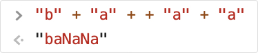

# 🙌 Introduction
이 저장소는 IT창업동아리 <a herf="https://www.ceos.or.kr/">CEOS</a> 프론트엔드 팀에서 스터디를 하며 수행한 미션의 결과를 공유합니다.

# 🚩 미션 원문 링크
https://github.com/CEOS-Developers/vanilla-todo-14th

# 🚩 결과물 링크

# ✍ 요구사항 분석

1. html
- [x] 중앙 컨테이너
- [x] 대기중 / 완료됨 구분
- [x] 새로운 할일 추가 입력 받기
- [x] 새로운 할일 추가 버튼
- [x] 목록에서 삭제 버튼
2. css
- [x] 배경색 추가
- [x] 폰트 조절, 대기중완료됨 / 목록 / 새로운 할일 추가
- [x] 스크롤(오버플로우)
- [x] 삭제 버튼 안보이게 - js로 처리
- [x] 완료됨 영역에서는 흐리게 + 취소선

1. js
- [x] 목록 개수 카운트
- [x] 클릭시 반대편으로 이동
- [x] 입력 후 추가버튼 누르면 대기열에 추가

 
 

# ✔ 필수 요건
- [x] 결과 화면 구현
- [x] CSS Flexbox 이용
- [x] 외부 라이브러리 X
- [x] lowerCamelCase
- [x] 코딩 단위 기능별 Commit 메세지 작성

# ✔ 선택 요건
- [x] 외부 폰트 사용: 눈누 사이트에서 ELAND_Choice_M 사용
- [x] local storage로 데이터 보존

# ✔ 커스터마이징
- [x] __할일을 모두 완료하면 라이언이 따봉을 줍니다!😆😆__
- [x] 이모지 사용, 모서리 다듬기, 색상 변경
- [x] item class를 선언, 객체들을 배열 하나로 관리

# 🤔 key Questions
### DOM은 무엇인가요? 
:DOM(Document Object Model)은 문서 객체 모델로, 문서를 계층적으로 구조화하여 사용자가 조작할 수 있도록 돕는 인터페이스이다.
  

### HTML (tag) Element를 JavaScript로 생성하는 방법은 어떤 것이 있고, 어떤 방법이 가장 적합할까요? 
1. `document.createElement`,`document.createTextNode()`는 Element를 생성한다. 요소인지 그 안의 텍스트인지에 따라 차이가 있다.
2. `Node.appendChild`, `Node.innerHTML`,`Node.textContent`처럼 노드를 먼저 가져온 후 거기 덧붙이는 방식으로 생성할 수도 있다. html 뼈대가 어느정도 잡혀 있다면 일반적으로 2번 방식이 더 유리한 듯 하다.(1번도 어차피 위치를 잡아줘야하기 때문)

### input태그에서 발생하는 Event에는 어떤 것이 있고, 어떤 방법이 가장   적합할까요? 
: <a herf="https://maxkim-j.github.io/posts/keyboard-input">여기</a>를 참고합시다. 
7가지 이벤트가 있으며,
focus => keyDown => (keyPress) => input => keyUp => blur => change 순으로 발생합니다.

### Flexbox Layout은 무엇이며, 어떻게 사용하나요? 
: css에서 `display:flex`를 이용하면 됩니다. 주 축과 수직축을 가지고 요소들을 컨테이너 안에서 자유롭게 배치할 수 있습니다. <a href="https://flexboxfroggy.com/#ko">여기</a>에서 연습할 수 있어요.

### JavaScript가 다른 언어들에 비해 주목할만한 점에는 어떤 것들이 있나요? 

 
~~JS는 바나나를 좋아합니다~~
- 프로토타입 기반 객체 지향 언어
- 인터프리터
- 동적타이핑, 약타입 언어. 유연함.
- 함수가 일급 객체
- 고차함수 존재

###  코드에서 주석을 다는 바람직한 방법은 무엇일까요?
- 간결하게, 이해하기 쉽도록
- 일관되게
- 연속되는 라인에 있을 때는 정렬
- 업데이트하기 용이하도록

등이 있을 것 같습니다.